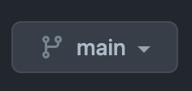
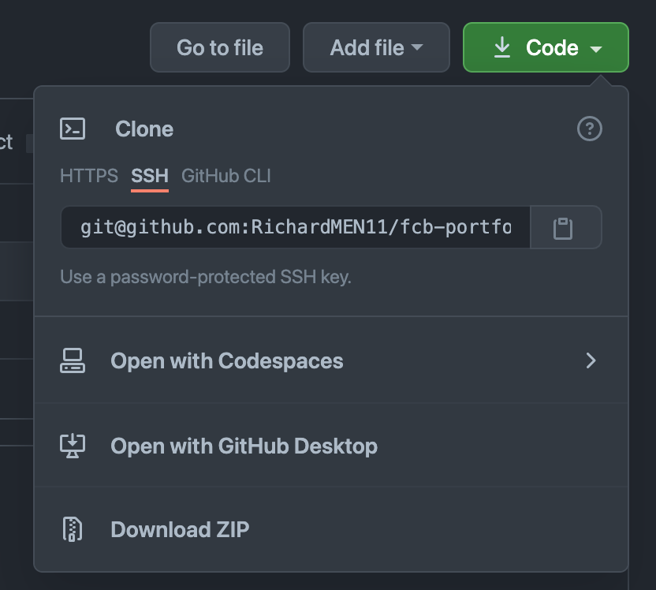

## Portfolio Page

This is a workshop for the female coding bootcamp by TechLabs and Generation F.

## How it works 🗯

The goal of the workshop is to learn the fundamentals of vscode and build a first small portfolio page.

1. Go to the starting point

   First you can checkout the starting point of the workshop.

   Just change the branch via the icon on the top left and choose 000-starting-point on the appearing dropdown.

2. Just download the files via zip or copy its content.
3. Change to the next steps by clicking again on the button you clicked at first and choose a different step (for example: 001...)

## Useful links 🔗

- [Presentation-Link](https://docs.google.com/presentation/d/1t8E1LuwLooT2nLx6Lc2KUJgpVHMCPhcBRoVxFOoU_W4/edit?usp=sharing)
- [Figma-Link](https://www.figma.com/file/fnZ9OIPlb6UqnZUtVdM4G0/Portfolio-Page-Template)
- [VSCode Download](https://code.visualstudio.com/download)
- [Live Server Plugin](https://marketplace.visualstudio.com/items?itemName=ritwickdey.LiveServer)

## FAQ

How do I download the files as zip file?

 
Click on Code and than on Download ZIP as seen in the screenshot.

Can I use this as my own page?

 
Sure! Just change the name to yours and change everything you like.

